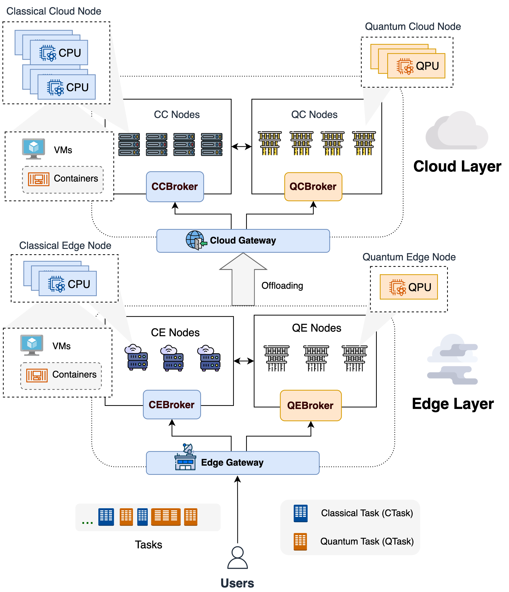
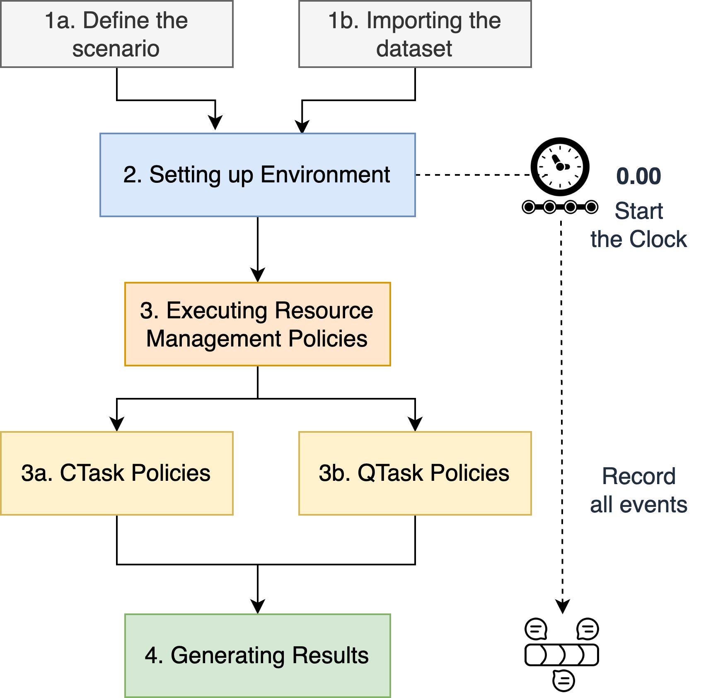
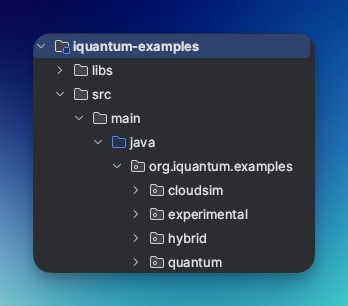

# iQuantum  [](https://github.com/Cloudslab/iQuantum/actions/workflows/maven.yml)

##  A Toolkit for Modeling and Simulation of Quantum Computing Environments
As quantum computers become increasingly accessible through cloud services and potentially extend to edge networks in the future, the demand for efficient resource management strategies is paramount to ensure the efficient utilization of quantum computing resources. However, the limitations of employing practical quantum computing resources and the lack of quantum environment modeling toolkits have hindered the design and evaluation of quantum resource management policies. To address this challenge, we propose iQuantum, a lightweight and versatile discrete-event modeling and simulation toolkit (based on CloudSim) for quantum computing environments. iQuantum provides a set of quantum computing entities that can be customized and extended to support a wide range of different hybrid quantum computing environments, supporting research in quantum resource management (e.g., task scheduling, backend selection, hybrid task orchestration), designing and prototyping of quantum computing systems. 

<p align="center">

</p>

## Main Features
- Modeling quantum computing entities: Quantum Datacenters (QDatacenter),
  Quantum Computers (QNode), QPU, Quantum Tasks (QTask), and Quantum Broker (QBroker).
- Modeling classical computing entities: Classical Datacenters (CDatacenter),
  Classical Computers (CNode), CPU, Classical Tasks (CTask), and Classical Broker (CBroker).
- Modeling Gateways and offloading policies from edge to cloud layer.
- Modeling QTask scheduling, qubit mapping, and quantum node selection policies for quantum computing environments.
- Modeling Hybrid Quantum-Classical Task Orchestration in the Cloud-Edge Continuum.
- Importing quantum nodes and workload dataset (from calibration data and QASM files) and exporting simulation results.

## Setup and Using
Please refer to the [Release page](https://github.com/Cloudslab/iQuantum/releases) to access the latest release of iQuantum (1.0.0-beta).
The downloaded package contains the main jar file (`iquantum-1.0.0-beta.jar`) and the entire source code of iQuantum.

### Prerequisites
- Java SDK 17+ ([corretto-17](https://docs.aws.amazon.com/corretto/latest/corretto-17-ug/downloads-list.html) is recommended).
- [Apache Maven](https://maven.apache.org/download.cgi) (All library management and build automation in iQuantum are handled by Maven; version 3.9+ is recommended)
- [IntelliJ IDEA](https://www.jetbrains.com/idea/) (latest version, 2023+) is highly recommended for customizing the source code (e.g., resource management policies or other entities)

### Building from Source
To build iQuantum from source, please follow these steps:
1. Clone the iQuantum repository to your local machine.
2. Open the project in IntelliJ IDEA.
3. Build the project using Maven.
4. The built jar file (`iquantum-1.0.0-beta.jar`) will be located in the `/modules/iquantum/target` folder.
5. Add the built jar file to your project's classpath.
6. You are ready to use iQuantum in your project.

### Modeling and Simulation Workflow
The simulation workflow of iQuantum is illustrated as follows:



1. **Modeling**: The user defines the quantum computing environment (e.g., quantum datacenters, quantum computers, quantum tasks, and quantum brokers) using the iQuantum entities.
   - Quantum tasks and quantum nodes can be modeled manually or automatically by importing from dataset (.csv), which can be generated from QASM files for quantum tasks (e.g., using [MQT Bench](https://www.cda.cit.tum.de/mqtbench/)) and system calibration datasheet (e.g., from [IBM Quantum](https://quantum-computing.ibm.com/lab/docs/iql/manage/systems/configuration)).
   - Resource management policies (scheduling, mapping, backend selection, and offloading) can be customized by extending the corresponding classes (in `org.iquantum.policies` package).
2. **Environment Setup**: The user defines the simulation parameters and start the simulation. 
3. **Simulation**: The discrete-event simulation engine of iQuantum simulates the events in the quantum computing environment (e.g., task submission, task execution, task completion, etc.), based on the defined resource management policies.
4. **Generating the results**: The simulation results (e.g., task execution time, backend allocation, cost of execution, etc.) can be shown or exported to a .csv file for further analysis.

### Examples of Operation
Several examples that demonstrate the use of iQuantum can be found in the `org.iquantum.examples` package, located in the `/modules/iquantum-examples` folder.


- `quantum`: Examples of modeling quantum computing environments.
- `cloudsim`: Examples of modeling classical cloud computing environments (derived from CloudSim).
- `hybrid`: Examples of modeling hybrid quantum-classical computing environments in cloud and edge layers.
- `experimental`: Experimental examples of extending iQuantum with new features.


## Contributing
Pull requests are welcome.
For major changes, please open an issue first to discuss what you would like to change.

## References
[1] Hoa T. Nguyen, Muhammad Usman, and Rajkumar Buyya, [iQuantum: A toolkit for modeling and simulation of quantum computing environments](https://doi.org/10.1002/spe.3331), Software: Practice and Experience, Wiley, 2024, ISSN: 1097-024X, 1–31. DOI: 10.1002/spe.3331 **(Main reference)**

[2] Hoa T. Nguyen, Muhammad Usman, and Rajkumar Buyya, [iQuantum: A Case for Modeling and Simulation of Quantum Computing Environments](https://ieeexplore.ieee.org/document/10234319), Proceedings of the 2023 IEEE International Conference on Quantum Software (QSW 2023, IEEE CS Press, USA), Chicago, USA, July 2-8, 2023. DOI: 10.1109/QSW59989.2023.00013

**BibTeX entry**
```
@article{nguyen2024iquantum,
  title         = {{iQuantum}: A toolkit for modeling and simulation of quantum computing environments},
  author        = {Nguyen, Hoa T. and Usman, Muhammad and Buyya, Rajkumar},
  year          = {2024},
  journal       = {Software: Practice and Experience},
  pages         = {1--31},
  doi           = {https://doi.org/10.1002/spe.3331},
  url           = {https://onlinelibrary.wiley.com/doi/abs/10.1002/spe.3331},
}
```

## License
[GNU General Public License v3.0](https://www.gnu.org/licenses/gpl-3.0.en.html)
